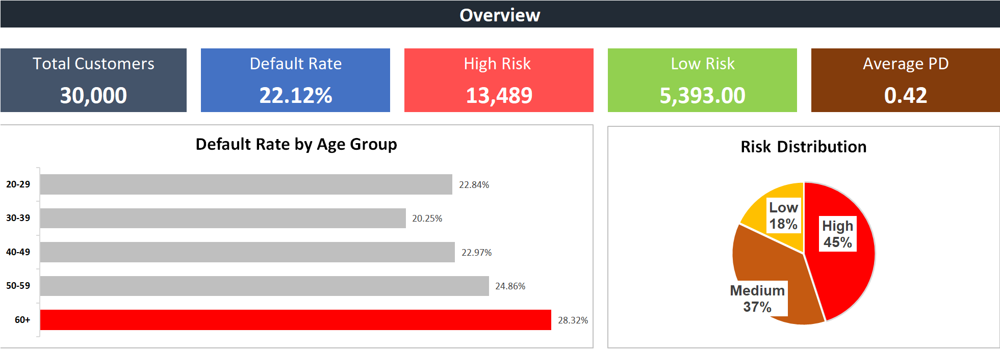
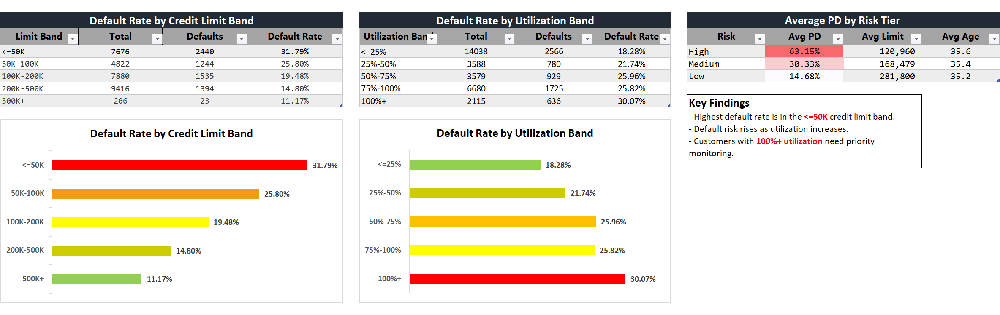
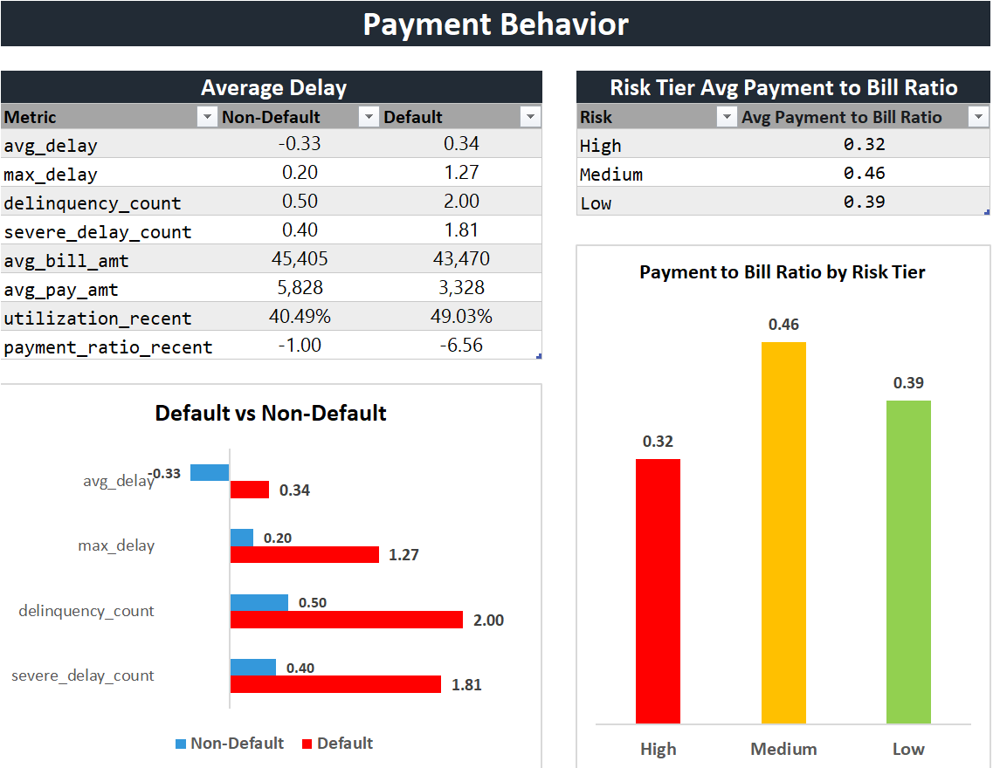
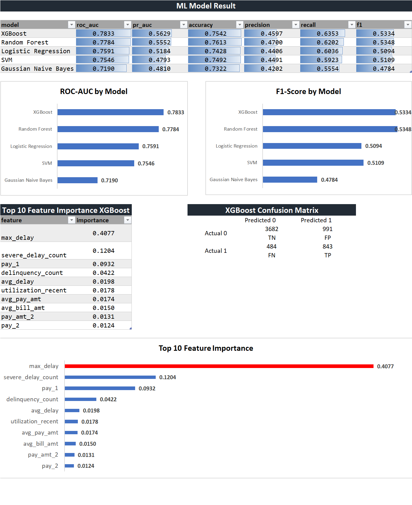
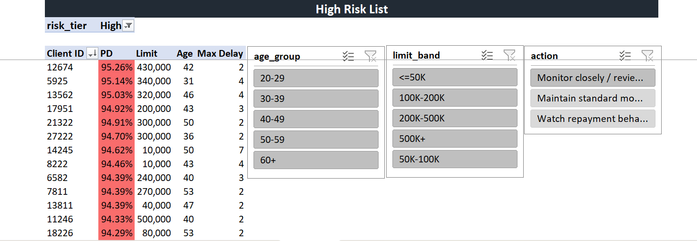

# Credit Card Default Risk Prediction & Excel Dashboard

This is a credit risk analytics portfolio project. It predicts credit card default risk, compares five classic ML models, and exports clean CSV files for an Excel dashboard.

## Dataset

- Source: [UCI Default of Credit Card Clients](https://archive.ics.uci.edu/dataset/350/defaultofcreditcardclients)
- Records: 30,000 credit card clients
- Target: `default_next_month`
- Original context: Taiwan credit card clients

## Project Structure

```text
data/raw/
data/processed/
notebooks/01_credit_default_model.ipynb
dashboard/
assets/
src/train_model.py
requirements.txt
README.md
```

## How to Run

Use Python 3.10+.

```powershell
pip install -r requirements.txt
python src/train_model.py
```

The script downloads the UCI dataset, trains the models, and creates these Excel-ready files:

```text
data/processed/credit_default_scored.csv
data/processed/model_metrics.csv
data/processed/feature_importance.csv
data/processed/confusion_matrix.csv
data/processed/run_summary.json
```

## Machine Learning Models

The project compares five models:

- Logistic Regression: explainable baseline
- Random Forest: tree-based comparison model
- XGBoost: final scoring model used for Excel dashboard risk tiers
- SVM: comparison model with RBF kernel and probability output
- Gaussian Naive Bayes: classic probabilistic baseline

Metrics are calculated on the test set only:

- ROC-AUC
- PR-AUC
- Accuracy
- Precision
- Recall
- F1-score
- Confusion matrix

SVM and Gaussian Naive Bayes are included as comparison models. They are not treated as production-ready final models in this project.

## Feature Engineering

Created features include:

- `utilization_recent`
- `payment_ratio_recent`
- `avg_delay`
- `max_delay`
- `delinquency_count`
- `severe_delay_count`
- `avg_bill_amt`
- `avg_pay_amt`
- `bill_growth`
- `payment_to_bill_6m`
- `age_group`
- `limit_band`
- `utilization_band`

## Excel Dashboard

The final dashboard is built in Microsoft Excel using PivotTables, PivotCharts, slicers, and conditional formatting.

Dashboard workbook path:

```text
dashboard/Credit_Default_Risk_Dashboard.xlsx
```

Import or connect these processed CSV files into Excel:

- `data/processed/credit_default_scored.csv`
- `data/processed/model_metrics.csv`
- `data/processed/feature_importance.csv`
- `data/processed/confusion_matrix.csv`

Recommended dashboard sheets:

1. Overview
2. Risk Analysis
3. Payment Behavior
4. ML Model Result
5. High Risk Customer List

## Dashboard Preview

Save screenshots in the `assets/` folder using these exact filenames:

```text
assets/overview.png
assets/risk_analysis.png
assets/payment_behavior.png
assets/ml_result.png
assets/high_risk_customers.png
```












## Bullet

Developed a credit card default risk prediction project using Logistic Regression, Random Forest, XGBoost, SVM, and Gaussian Naive Bayes on 30,000 customer records. Engineered repayment behavior and utilization features, evaluated models using ROC-AUC, PR-AUC, recall, precision, F1-score, and confusion matrix, and exported XGBoost risk probabilities into Excel for portfolio monitoring and high-risk customer analysis.

## Limitations

- Dataset is public UCI data from Taiwan
- Risk tiers are simple business thresholds for dashboard storytelling, not official credit policy.

## Latest Run Results

Latest verified run created 30,000 scored rows with no missing or infinite values in the Excel-ready output.

| Model                | ROC-AUC | PR-AUC | Accuracy | Precision | Recall |     F1 |
| -------------------- | ------: | -----: | -------: | --------: | -----: | -----: |
| XGBoost              |  0.7833 | 0.5629 |   0.7542 |    0.4597 | 0.6353 | 0.5334 |
| Random Forest        |  0.7784 | 0.5552 |   0.7613 |    0.4700 | 0.6202 | 0.5348 |
| Logistic Regression  |  0.7591 | 0.5184 |   0.7428 |    0.4406 | 0.6036 | 0.5094 |
| SVM                  |  0.7546 | 0.4793 |   0.7492 |    0.4491 | 0.5923 | 0.5109 |
| Gaussian Naive Bayes |  0.7190 | 0.4810 |   0.7322 |    0.4202 | 0.5554 | 0.4784 |

